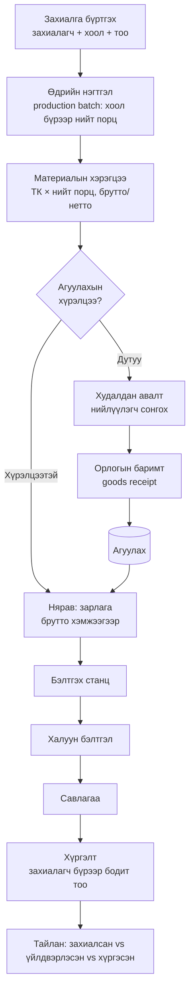

# Хоол үйлдвэрлэлийн хяналтын систем — Системийн тодорхойлолт

> Төслийн стек: Next.js (App Router) + Supabase (PostgreSQL, Auth) + shadcn/ui + Tailwind CSS

## 1. Системийн зорилго

Захиалагчдаас ирсэн өдрийн захиалгыг нэгтгэн **технологийн картын дагуу** материалын хэрэгцээг автоматаар тооцоолж, агуулахын хүрэлцээг шалгаж, үйлдвэрлэлийн цэг (станц) бүрт ажлын жагсаалт гаргаж, үйлдвэрлэл → савлагаа → хүргэлтийн урсгалыг хянах, мөн нийлүүлэгчээс татсан бараа материалын орлого/зарлагыг бүртгэх систем.

**Жишээ урсгал:** ABC сургууль 500, XYZ компани 200, 123 цэцэрлэг 300 порц "Үхрийн махтай хуурга" захиалахад систем **нийт 1,000 порц** гэж нэгтгэж, технологийн картаас материалын хэрэгцээг (1 порц × 1,000) тооцоолж, агуулахын үлдэгдэлтэй харьцуулж дутууг анхааруулна. Станцууд нэгтгэсэн 1,000 порцыг нэг удаа үйлдвэрлэж, хүргэлт нь захиалагч бүрээр буцаж салгагдан бүртгэгдэнэ.

---

## 2. Гол ойлголтууд

### 2.1 Master data ба Transaction-ийн ялгаа

Системийн архитектурын гол зарчим:

- **Master data (лавлах):** Нэг удаа бүртгэгдээд удаан хугацаанд ашиглагдана — Захиалагч, Нийлүүлэгч, Материал, Хоол, Технологийн карт, Агуулах.
- **Transaction (гүйлгээ):** Өдөр тутам үүснэ — Захиалга, Үйлдвэрлэлийн батч, Орлогын баримт, Зарлага, Хүргэлт.

> **Захиалагчийн бүртгэл ≠ Захиалга.** ABC сургуулийг `customers`-т нэг удаа бүртгэнэ, өдөр бүрийн тоо нь `orders`-т бүртгэгдэнэ. Мөн **Нийлүүлэгч ≠ Орлогын баримт** — нийлүүлэгч нь лавлах, харин ямар нийлүүлэгчээс юуг хэдийг авсан нь орлогын баримт (goods receipt).

```text
MASTER DATA                          TRANSACTIONS
│                                    │
├── Materials                        Customer
│    ├── Material (материал)            ↓
│    ├── Category                    ORDER / ORDER_ITEM
│    └── Unit                           ↓
├── Products                         Production Batch (өдрийн нэгтгэл)
│    ├── Product (хоол)                 ↓
│    └── Technology Card             Material Requirement
├── Customers                           ↓
│    └── Customer Master             Stock Check ──┬── Хүрэлцээтэй → Production
├── Suppliers                                      └── Дутуу → Purchase → Supplier
│    ├── Supplier Master                                → Goods Receipt → Warehouse
│    └── Material‑Supplier холбоо        ↓
└── Organization                     Station Tasks → Савлагаа → Delivery
     └── Warehouse
```

### 2.2 Технологийн карт (ТК)

Хоол үйлдвэрлэлд хэрэглэгддэг стандарт баримт бөгөөд нэг нэр төрлийн хоолны:

- **Орц (найрлага)** — материал бүрийн нэр, хэмжих нэгж
- **Брутто жин** — боловсруулалтын өмнөх (арьс, яс, хальстай) жин. *Агуулахаас зарлагадах хэмжээг үүгээр тооцно.*
- **Нетто жин** — цэвэрлэж бэлтгэсний дараах жин. *Тогооч руу очих бэлтгэлийн хэмжээ.*
- **Бэлэн бүтээгдэхүүний гарц** — болгосны дараах 1 порцын жин (чанах/шарахад жин хорогддог)
- **Технологийн заавар** — бэлтгэх дараалал, аль станцад ямар боловсруулалт хийхийг заана

> Брутто/нетто ялгаа чухал: 1,000 порцод "үхрийн мах нетто 150 кг" хэрэгтэй бол яс, өөх, хаягдлын хувь 20% гэвэл агуулахаас **брутто ~188 кг** зарлагадах ёстой. ТК-д нэг л жин хадгалбал агуулахын үлдэгдэл бодит байдлаас байнга зөрнө — тиймээс орц бүрт хоёр жинг хоёуланг нь хадгална.

### 2.3 Үйлдвэрлэлийн нэгтгэл (Production Batch)

Нэг өдөр олон захиалагч ижил хоол захиалдаг. Станцууд захиалагч бүрээр тусад нь биш, **нэгтгэсэн нийт тоогоор нэг удаа** үйлдвэрлэнэ:

```text
ABC сургууль    Үхрийн махтай хуурга   500      ┐
XYZ компани     Үхрийн махтай хуурга   200      ├─▶  2026-08-14 · ҮХРИЙН МАХТАЙ ХУУРГА
123 цэцэрлэг    Үхрийн махтай хуурга   300      ┘        Нийт үйлдвэрлэх: 1,000 порц
```

Тиймээс захиалгын мөр → **үйлдвэрлэлийн батч** (өдөр + хоол + нийт тоо) → станцын ажлууд гэсэн давхаргатай байна. Харин хүргэлт нь батчаас биш, захиалгын мөрөөс (захиалагч бүрээр) бүртгэгдэнэ:

```text
order_items (захиалагч бүрээр) ──нэгтгэнэ──▶ production_batches (өдөр+хоол) ──▶ station_tasks
     └──────────────────────────────────────▶ deliveries (захиалагч бүрээр буцаж сална)
```

### 2.4 Үйлдвэрлэлийн цэгүүд (станцууд)

| Станц | Үүрэг | Систем дээр харагдах зүйл |
|---|---|---|
| **Бэлтгэх** | Материалыг угаах, цэвэрлэх, хэрчих, жинлэх (хүйтэн боловсруулалт) | ТК-ийн дагуу бэлтгэх материалын жагсаалт (брутто → нетто) |
| **Халуун бэлтгэл** | Чанах, шарах, болгох (халуун боловсруулалт) | Бэлтгэсэн орцын жагсаалт, технологийн заавар, гарцын хэмжээ |
| **Савлагаа** | Бэлэн хоолыг порцлох, савлах, шошголох | Савлах порцын тоо, савлагааны материалын хэмжээ |

Станц бүр өөрт оногдсон ажлыг **"Хүлээгдэж буй → Хийгдэж буй → Дууссан"** төлөвөөр удирдана.

### 2.5 Агуулах: баримт → ledger зарчим

Давхар бүртгэлээс сэргийлэхийн тулд нэг мөр дүрэм баримтална:

- **Баримтууд** (орлогын баримт `goods_receipts`, зарлагын хүсэлт `stock_issues`) нь хүлээгдэж буй/батлагдсан төлөвтэй бичиг баримт.
- Баримт **батлагдах мөчид л** `stock_movements` (ledger) хүснэгтэд гүйлгээ үүснэ.
- **Үлдэгдэл** = ledger-ийн нийлбэр. Үлдэгдлийг гараар засахгүй, зөвхөн гүйлгээгээр өөрчлөгдөнө (тооллогын залруулга ч `adjust` төрлийн гүйлгээ болно).
- Stock balance дээр нийлүүлэгчийг хадгалахгүй — "8-р сард Supplier A-аас хэдэн кг мах авсан бэ?" гэдгийг Goods Receipt → Supplier холбоогоор тайлагнана.

**Source of truth шийдвэр (2026-08-20, `0002_warehouse_ledger.sql`):**

- `stock_movements` нь **append-only** — UPDATE/DELETE-ийг DB trigger-ээр хориглосон; залруулга зөвхөн `adjust` төрлийн шинэ мөрөөр.
- Үлдэгдэл `stock_balances` **view**-ээр (ledger-ийн SUM, exact numeric) гарна — тусдаа balance хүснэгт/багана хөтлөхгүй (drift-гүй; хожим удаашвал snapshot нэмэхэд ledger-ээс шууд гарна).
- Баримт батлах нь **атомик RPC** (`confirm_goods_receipt(p_receipt_id, p_actor)`): статус солих + ledger бичих нэг transaction-д, `FOR UPDATE` түгжээгээр давхар батлахаас хамгаална. Frontend-ээс хоёр тусдаа insert хийхгүй.
- Батлагдсан баримтын мөрийг өөрчлөхийг trigger-ээр хориглоно — буруу бол adjust/сторно гүйлгээ.
- Зарлага дээр сөрөг үлдэгдлийг **хориглохгүй, анхааруулна** (нярав бодит байдлыг бүртгэдэг) — зарлагын алхам дээр хэрэгжинэ.

Бүтэн жишээ урсгал:

```text
1. Админ баримт үүсгэнэ (draft — агуулахад нөлөөгүй):
   goods_receipts:      GR-000001 · Мах Импекс · падаан №INV-4512 · draft
   goods_receipt_items: Үхрийн мах · 100 kg × 1  → 100 kg · 18,500₮ · lot A-12
                        Сав        · 3 box × 12  →  36 pcs ·    250₮

2. "Батлах" → confirm_goods_receipt(id, 'Болд') нэг transaction-д:
   stock_movements:     Үхрийн мах · in · +100 kg · 18,500₮ · GR-000001 · Болд
                        Сав        · in ·  +36 pcs ·   250₮ · GR-000001 · Болд
   goods_receipts:      status=confirmed (үүнээс хойш баримт, мөр өөрчлөгдөхгүй)

3. Үлдэгдэл = stock_balances view (ledger-ийн SUM):
   Үхрийн мах 100 kg · Сав 36 pcs
```

```text
Мах Импекс · Үхрийн мах 100 кг × 18,500₮
        ↓  (баримт баталгаажив)
GOODS_RECEIPT GR-000125
        ↓
STOCK_MOVEMENTS  +100 кг
        ↓
Үлдэгдэл: 25 кг + 100 кг = 125 кг
```

---

## 3. Ажлын урсгал (Workflow)



### Алхам дэлгэрэнгүй

1. **Захиалга бүртгэх** — Менежер захиалагчийг лавлахаас сонгож өдрийн захиалгыг оруулна: захиалагч, хоол(ууд), порцын тоо, хүргэх огноо/цаг. Нэг захиалагч нэг өдөр олон хоол захиалж болно (ORDER → ORDER_ITEM).
2. **Автомат нэгтгэл ба тооцоолол** — Захиалгууд батлагдмагц систем:
   - Өдрийн бүх захиалгын мөрийг хоол бүрээр нэгтгэж **үйлдвэрлэлийн батч** үүсгэнэ (хуурга 1,000, бууз 300 г.м.)
   - Батч бүрийн ТК-аас материалын хэрэгцээг брутто/нетто хоёулангаар тооцоолж, ижил материалыг батчуудын дундуур нэгтгэнэ
   - Хэрэгцээг агуулахын үлдэгдэлтэй харьцуулж **хүрэлцээний хүснэгт** гаргана:

   ```text
                      Хэрэгцээ   Үлдэгдэл   Зөрүү
   Үхрийн мах          150 кг     120 кг    🔴 -30
   Сонгино              30 кг      50 кг    🟢 +20
   Сав                1,000 ш      700 ш    🔴 -300
   ```
   - Станц бүрийн ажлын хуудсыг батчаас үүсгэнэ
3. **Дутуу материал → худалдан авалт** — Дутуу мөр дээр материалын нийлүүлэгчид (үнэ, үндсэн эсэх) харагдаж, худалдан авалтын шийдвэр гаргана. *(Худалдан авалтын захиалгыг системд бүртгэх нь хожмын үе шат — эхэндээ зөвхөн дутагдлын анхааруулга.)*
4. **Орлого** — Байгууллагын админ (менежер) "Бараа хүлээн авах" дэлгэцээс нийлүүлэгч, баримтын №, материалын мөрүүдийг (тоо, нэгж, үнэ, lot, дуусах хугацаа) бүртгэж баталгаажуулна → ledger-т орлогын гүйлгээ үүснэ. *Нийлүүлэгч системд нэвтэрдэггүй — нэхэмжлэл/падаан нь цаасаар/имэйлээр ирж, админ л системд бүртгэнэ (`supplier_invoice_no` нь тэр баримтын дугаарын лавлагаа).*
5. **Няравын зарлага** — Нярав тооцоолсон брутто жагсаалтыг үндэслэн материал гаргаж зарлагын баримт баталгаажуулна. Бодит гаргасан хэмжээ тооцооллоос зөрвөл зөрүүг тэмдэглэнэ.
6. **Станцуудын гүйцэтгэл** — Станц бүр батчийн ажлын жагсаалтаа хараад гүйцэтгэлээ тэмдэглэнэ (эхэлсэн/дууссан цаг, ажилтан).
7. **Хүргэлт** — Савлагаа дууссаны дараа захиалгын мөр бүрээр бодит хүргэсэн тоог бүртгэнэ. Захиалга дээрх хүргэх огноо/цаг нь *төлөвлөгөө*, энд бүртгэх нь *бодит гүйцэтгэл* — хоёулаа хадгалагдана.
8. **Тайлан** — Өдрийн/сарын үйлдвэрлэл, материалын зарцуулалт (норм vs бодит), нийлүүлэгчээр татан авалт, агуулахын үлдэгдэл, хүргэлтийн зөрүү.

---

## 4. Хэрэглэгчийн дүрүүд (Roles)

| Дүр | Эрх |
|---|---|
| **Менежер (админ)** | Бүх эрх: захиалагч/нийлүүлэгч/ТК болон лавлах удирдах, захиалга бүртгэх/батлах, хэрэглэгч удирдах, тайлан харах |
| **Нярав** | Агуулахын орлого/зарлага бүртгэх, үлдэгдэл харах |
| **Станцын ажилтан** | Зөвхөн өөрийн станцын ажлын жагсаалт харах, гүйцэтгэл тэмдэглэх |
| **Хүргэлт** | Хүргэлтийн тоо бүртгэх |

> **Тест/хөгжүүлэлтийн горим:** Эхний ээлжид login хэрэглэхгүй (`NEXT_PUBLIC_DEV_NO_AUTH=true`). Sidebar-ын толгойд байрлах **хэрэглэгч солигч** dropdown-оор (`UserSwitcher`) дүрээ сольж бүх дэлгэцийг шалгана. Mock хэрэглэгчид `src/lib/dev-users.ts`-д тодорхойлогдсон. Supabase Auth + `profiles.role` + RLS (Row Level Security)-ийг сүүлийн үе шатанд идэвхжүүлнэ.
>
> **Дүрийн хязгаарлалт (UI түвшинд, хэрэгжсэн):** Зам бүрийн хандах эрхийг `src/lib/permissions.ts`-ийн `PAGE_ROLES` дээр тодорхойлно. Sidebar-ын цэс дүрд нь эрхгүй хуудсыг нуана, хуудас руу шууд хаягаар орвол "Хандах эрхгүй" мэдэгдэл харуулна. Шинэ хуудас нэмэхдээ `PAGE_ROLES`-д мөр нэмнэ (тодорхойлоогүй зам бүх дүрд нээлттэй). Энэ нь тест горимын UI шалгалт бөгөөд Үе 6-д RLS-ээр давхар хамгаална.

---

## 5. Өгөгдлийн загвар (Supabase / PostgreSQL)

```mermaid
erDiagram
    customers ||--o{ orders : ""
    orders ||--o{ order_items : ""
    order_items }o--|| products : ""
    order_items }o--|| production_batches : "өдөр+хоолоор нэгтгэнэ"
    order_items ||--o{ deliveries : "захиалагч бүрээр"
    production_batches ||--o{ station_tasks : "станц бүрт"
    products ||--|| tech_cards : "1 идэвхтэй ТК"
    tech_cards ||--o{ tech_card_items : "орцууд"
    tech_card_items }o--|| materials : ""
    suppliers ||--o{ material_suppliers : ""
    materials ||--o{ material_suppliers : ""
    suppliers ||--o{ goods_receipts : ""
    goods_receipts ||--o{ goods_receipt_items : ""
    goods_receipt_items }o--|| materials : ""
    production_batches ||--o{ stock_issues : "тооцоолсон хэрэгцээ"
    stock_issues }o--|| materials : ""
    materials ||--o{ stock_movements : "ledger"
```



### Master data хүснэгтүүд

**profiles** — хэрэглэгч (Supabase auth.users-тэй 1:1)
- `id (uuid, FK auth.users)`, `full_name`, `role (manager|storekeeper|station|delivery)`, `station (prep|hot|packaging, nullable)`

**customers** — захиалагчийн лавлах
- `id`, `code (CUS-001, автоматаар үүснэ)`, `name`, `contact` (холбоо барих хүн + утас нэг талбарт), `email`, `address`, `delivery_note`, `is_active`, `created_at`, `updated_at`
- Нэг нэгээр нэмэхээс гадна **JSON object/array-аар олноор нэмэх** боломжтой (`name` заавал; `contact`, `email`, `address`, `delivery_note` сонголттой; код автоматаар олгогдоно)
- **Хасагдсан талбарууд (2026-08-14):** `customer_type` (сургууль/цэцэрлэг/байгууллага гэсэн ангилал — шаардлагагүй гэж үзэв), `contact_person` + `phone` (тусдаа хоёр талбар байсныг `contact` нэг талбарт нэгтгэв). Мөн `code`-ыг гараас оруулдаг байсныг автомат болгов. Schema: `supabase/migrations/0001_init.sql`.

> **Код олголт ба устгах бодлого (customers, suppliers):**
> - `code` нь DB талд **BEFORE INSERT trigger + sequence**-ээр олгогдоно (`0005_db_code_generation.sql`) — client талын "хамгийн их код + 1" аргыг хассан, учир нь хоёр хэрэглэгч зэрэг нэмэхэд ижил код үүсэх concurrency эрсдэлтэй байсан. `id` нь UUID primary key, `code` нь UNIQUE хэвээр.
> - **Физик DELETE хийхгүй** — UI-д устгах товч байхгүй, оронд нь **Идэвхтэй → Идэвхгүй** болгоно. Захиалагч удахгүй `orders`-т, нийлүүлэгч `goods_receipts`-т холбогдох тул ашиглагдсан бичлэгийг устгавал түүхэн мэдээлэл эвдэрнэ. Transaction хүснэгтүүдийн FK-г `on delete restrict`-ээр үүсгэж DB талд давхар хамгаална.

**suppliers** — нийлүүлэгчийн лавлах
- `id`, `code (SUP-001, автоматаар үүснэ)`, `name`, `contact` (холбоо барих хүн + утас нэг талбарт), `email`, `address`, `is_active`, `created_at`, `updated_at`
- Нэг нэгээр нэмэхээс гадна **JSON object/array-аар олноор нэмэх** боломжтой (`name` заавал; `contact`, `email`, `address` сонголттой; код автоматаар олгогдоно)
- **Хасагдсан талбарууд (2026-08-14):** `category` (мах/ногоо/сав баглаа гэсэн ангилал), `registration_no` (регистрийн №), `payment_terms` (төлбөрийн нөхцөл) — шаардлагагүй гэж үзэв; `contact_person` + `phone` → `contact` нэг талбарт нэгтгэв. Мөн `code`-ыг гараас оруулдаг байсныг автомат болгов. Schema: `supabase/migrations/0001_init.sql`.

**materials** — материалын лавлах (хүнс + сав баглаа + бусад)
- `id`, `code (MAT-001, системийн код, автоматаар үүснэ)`, `base_code` (гараас оруулах үндсэн код — нягтлан/агуулахын код гэх мэт; сонголттой, оруулсан бол case-insensitive UNIQUE), `name`, `base_unit (kg|l|pcs — canonical хэмжээс: жин/эзлэхүүн/тоо)`, `preferred_unit (kg|g|l|ml|pcs — оруулах/харуулах default нэгж, base_unit-тэй нийцтэй)`, `category (food|packaging|other)`, `min_stock` (доод үлдэгдлийн анхааруулга, base_unit-ээр хадгалагдана), `is_active`, `created_at`, `updated_at`
- **Шийдвэрүүд (2026-08-15, `0006_materials.sql`):** `unit` → `base_unit` нэрлэж canonical (латин) утгаар хадгална — хөрвүүлэлт зөвхөн харагдацын асуудал. Нэр (case-insensitive) UNIQUE — давхар материал үлдэгдэл/хэрэгцээний тооцоог салгаж зөрүүлэх тул. Үлдэгдэл, үнэ, нийлүүлэгчийг энд хадгалахгүй (ledger + `material_suppliers`-ийн ажил). Код олголт, устгахгүй-идэвхгүй болгох, JSON import — customers/suppliers-тэй ижил зарчим.
- **Нэгжийн шийдвэр (2026-08-18, эцсийн):**
  - **`base_unit` = `kg | l | pcs` — гуравхан canonical хэмжээс.** `g`, `ml` нь base unit биш. Ингэснээр DB дэх БҮХ тоо хэмжээ (ТК-ийн орц, орлого, зарлага, ledger, үлдэгдэл, хэрэгцээний тооцоо) нэг материалын хувьд нэг л нэгжтэй байж, шууд нэмэгдэж/харьцуулагдана.
  - **Зарчим: boundary дээр нэг удаа normalize.** Хэрэглэгч ямар нэгжээр оруулсан ч (15 гр, 10 мл, 3 хайрцаг) хадгалахаас өмнө canonical base unit руу хөрвүүлнэ; бизнесийн бүх тооцоо canonical нэгжээр явна; харуулахдаа л буцааж хөрвүүлнэ. Хөрвүүлэлт тооцооны дунд хэзээ ч орохгүй.
  - **`preferred_unit`** — тухайн материалыг оруулах/харуулах *default* нэгж (Давс → `g`, Тос → `ml`, Үхрийн мах → `kg`). Зөвхөн preference: ТК/орлогын форм нээхэд энэ нэгж default сонгогдоно; хэрэглэгч тухайн мөр дээр өөрчилж болно. Агуулахын үлдэгдэл, хэрэгцээний тайлан зэрэг том хэмжээний харагдац `base_unit`-ээр хэвээр (25.4 kg, 125 l). DB CHECK: `kg→{kg,g}`, `l→{l,ml}`, `pcs→{pcs}`; NOT NULL, default = base_unit.
  - **Хөрвүүлэлт нэг л газар — `src/lib/units.ts`:** `toBase(qty, unit)` (g→kg ÷1000, ml→l ÷1000, бусад ×1) ба `fromBase(qty, base_unit, unit)` (×1000). Үр дүнг 6 орны нарийвчлалд round хийнэ (float алдаа арилгах, DB-ийн `numeric(14,6)`-тай таарна). ТК, орлого, үйлдвэрлэл, тайлан — бүгд энэ модулийг дуудна, өөрсдөө ÷1000 бичихгүй.
  - **Нарийвчлал:** бүх тоо хэмжээ (`min_stock`, `*_qty`, `*_quantity`) `numeric(14,6)` — 0.000001 kg (1 мг) хүртэл; integer хэрэглэхгүй (0.5 ш өндөг ч байж болно).
  - **float-д найдахгүй:** JS `number` нь зөвхөн UI boundary (оруулах/харуулах, `lib/units.ts`-ийн 6 орны round)-д. Ledger-ийн үлдэгдэл, хэрэгцээний нийлбэр, өртгийн тооцоо зэрэг бизнесийн нийлбэрүүдийг **DB талд** (view / SQL функц, exact `numeric` арифметик) гаргана — frontend дээр `reduce`-ээр нийлбэр бодохгүй. PostgREST `numeric`-ийг JSON number болгодог тул хожим шаардлага гарвал string/decimal хэлбэрээр авах хувилбарыг авч үзнэ (MVP-д хэрэггүй).
  - **ТК-тай харьцах дүрэм:** `tech_card_items`-ийн `brutto_qty`/`netto_qty` материалын `base_unit`-ээр хадгалагдана (150 гр → 0.150) — мөр дээр тусдаа `unit` талбар **байхгүй**, нэгж нь `material_id → materials.base_unit`-ээс тодорхойлогдоно. UI формд `preferred_unit`-ээр оруулж/харуулна.
  - **Брутто / нетто утга (semantic):** `brutto_qty` = агуулахаас шаардагдах түүхий эд (цэвэрлэхээс өмнөх), `netto_qty` = бэлтгэсний дараа үйлдвэрлэлд орох хэмжээ. CHECK: `netto_qty <= brutto_qty`. Хаягдлын хувийг хадгалахгүй — derived. Ашиглалт: **агуулахын хэрэгцээ / зарлагын норм = Σ брутто × порц** (`stock_issues.calculated_qty`), **бэлтгэлийн хүлээгдэж буй гарц = Σ нетто × порц**, **бодит зарцуулалт = `stock_issues.issued_qty`** — гурав нь тайланд харьцуулагдана (норм vs бодит, бэлтгэлийн хаягдал).
  - **Худалдан авалтын нэгж (хайрцаг, шуудай, боодол)** нь физик хэмжээс биш савлагааны нэгж тул `materials`-д **байхгүй**; хожим `material_suppliers.pack_unit` + `pack_qty` (1 хайрцаг = 12 kg, нийлүүлэгч бүрээр өөр) гэж хадгална. Нярав орлогод "3 хайрцаг" оруулахад ledger-т 36 kg бичигдэнэ.

**material_suppliers** — материал ↔ нийлүүлэгч (many-to-many: нэг материалыг олон нийлүүлэгчээс авч болно)
- `id`, `material_id`, `supplier_id`, `supplier_material_code`, `last_price`, `lead_time_days`, `is_preferred`, `is_active`

**products** — хоолны (эцсийн бүтээгдэхүүний) лавлах
- `id`, `code (PRD-001, автоматаар үүснэ)`, `name`, `description`, `is_active`, `created_at`, `updated_at`
- **Шийдвэрүүд (2026-08-15, `0007_dishes.sql` → `0008_dishes_to_products.sql` → `0009_products_drop_portion_weight.sql`):** Анх `dishes` нэртэй минимал (зөвхөн нэр) үүсгэснийг `products` болгож код, тайлбар нэмэв. 0008-д нэмсэн `portion_weight`-ийг 0009-д буцааж хасав — **гарцын жин нь жорын (ТК-ийн хувилбарын) шинж чанар**: v2 дээр орц өөрчлөгдвөл гарц дагаж өөрчлөгддөг тул product түвшинд хадгалбал хувилбар солигдох бүрд гараар давхар засах шаардлагатай болж, хуучин захиалгын түүх (`order_items.tech_card_id`) буруу жинтэй харагдана. Ангилал, үнэ зэрэг талбар одоохондоо нэмэхгүй; орц/жин/заавар бүгд ТК-д тодорхойлогдоно. Нэр (case-insensitive) UNIQUE — давхар хоол захиалга/батчийн нэгтгэлийг салгаж зөрүүлэх тул. Код олголт, устгахгүй-идэвхгүй болгох, JSON import — бусад лавлахтай ижил зарчим.

**tech_cards** — технологийн карт (хувилбартай: орц өөрчлөгдвөл шинэ хувилбар үүсгэж, хуучин захиалгын түүх хэвээр үлдэнэ)
- `id`, `product_id`, `version`, `portion_yield_g` (1 порцын гарцын жин, гр — хувилбар бүрээр), `instructions`, `is_active`
- Гарцын жин энд (хувилбартайгаа хамт) хадгалагдана: v1 = 350г, v2 = 380г гэх мэт. Products жагсаалтад жин харуулах бол идэвхтэй ТК-аас join хийнэ. Хэрэв хожим "нэрлэсэн жин" (захиалагчид амласан) ба "технологийн гарц" хоёрыг ялгах шаардлага гарвал тэр үед `products`-д нэрлэсэн жин нэмнэ.

**tech_card_items** — картын орц (1 порцод ногдох)
- `id`, `tech_card_id`, `material_id`, `brutto_qty`, `netto_qty` (хоёулаа `materials.base_unit`-ээр, `numeric(14,6)`; тусдаа `unit` талбар байхгүй — материалын нэгжийн шийдвэрийг үз), `station (prep|hot|packaging)` — тухайн орц аль станцад хэрэглэгдэхийг заана

### Transaction хүснэгтүүд

**orders** — захиалга (header)
- `id`, `order_no (ORD-000123)`, `customer_id`, `order_date`, `production_date`, `delivery_date`, `delivery_time` (төлөвлөгөө), `status (draft|confirmed|in_production|packed|delivered|closed)`, `note`, `created_by`, `created_at`

**order_items** — захиалгын мөр
- `id`, `order_id`, `product_id`, `tech_card_id` (баталсан үеийн хувилбарыг хадгална), `qty` (порцын тоо), `unit_price`, `note`

**production_batches** — өдрийн үйлдвэрлэлийн нэгтгэл (захиалгууд батлагдахад автоматаар үүснэ/шинэчлэгдэнэ)
- `id`, `production_date`, `product_id`, `tech_card_id`, `total_qty` (Σ order_items.qty), `status (planned|in_production|done)`

**station_tasks** — станцын ажлын хуудас (батчаас үүснэ — захиалагч бүрээр биш, нэгтгэсэн тоогоор)
- `id`, `production_batch_id`, `station`, `status (pending|in_progress|done)`, `started_at`, `finished_at`, `done_by`, `note`

**goods_receipts** — орлогын баримт (header) ✅ `0002_warehouse_ledger.sql`
- `id`, `receipt_no (GR-000001, sequence + trigger-ээр автомат)`, `supplier_id (FK restrict)`, `receipt_date`, `supplier_invoice_no`, `status (draft|confirmed)`, `received_by`, `confirmed_at`, `note`, `created_at`, `updated_at`
- Нэг удаагийн хүлээн авалтын ерөнхий мэдээлэл — материалын мөрүүд нь `goods_receipt_items`-т. Нийлүүлэгч системд нэвтэрдэггүй: падаан цаасаар/имэйлээр ирж, админ бүртгэнэ; `supplier_invoice_no` нь тэр цаасан баримтын дугаарын лавлагаа (чөлөөт текст).
- `draft` үед агуулахад ямар ч нөлөөгүй, чөлөөтэй засварлана; `confirmed` болмогц баримт өөрөө ч, мөрүүд нь ч өөрчлөгдөхгүй (trigger-ээр хориглоно).

**goods_receipt_items** — орлогын баримтын мөр (мөр = нэг материал) ✅ `0002_warehouse_ledger.sql`
- `id`, `goods_receipt_id (FK cascade)`, `material_id (FK restrict)`, `input_quantity` (админ оруулсан тоо: 3), `input_unit` (чөлөөт текст: `box`, `bag`, `kg`, `g`…), `conversion_rate` (1 input_unit = хэдэн base_unit; box→12, g→0.001, kg→1), `base_quantity` (**generated column** `= input_quantity × conversion_rate`, `numeric(14,6)`, base_unit-ээр — ledger энэ утгыг авна), `unit_price` (base_unit-ийн 1 нэгжийн үнэ — "нийлүүлэгч энэ мөрөнд ямар үнэ нэхсэн бэ" гэсэн худалдан авалтын утга), `lot_no`, `expiry_date` (хожмын FEFO зарлагад)
- **Snapshot дүрэм:** `conversion_rate`-ийг баримт дээр хадгална — `material_suppliers.pack_qty` хожим 12→15 болсон ч хуучин GR "3 box × 12 = 36 kg" хэвээр. Generated column тул `input × rate ≠ base` зөрүү гарах боломжгүй, normalize DB-д exact numeric-ээр хийгдэнэ.
- `goods_receipt_items_immutable` trigger: харьяа баримт `confirmed` бол INSERT/UPDATE/DELETE бүгд хориотой — залруулга зөвхөн `adjust` гүйлгээгээр.

**stock_issues** — үйлдвэрлэлийн зарлагын хүсэлт (батчийн тооцооллоос үүснэ, нярав баталгаажуулдаг)
- `id`, `production_date`, `material_id`, `calculated_qty` (норм = Σ брутто × порц), `issued_qty` (бодит), `status (pending|issued)`, `issued_by`, `issued_at`, `note`

**stock_movements** — агуулахын ledger, **source of truth** ✅ `0002_warehouse_ledger.sql`
- `id`, `material_id (FK restrict)`, `type (in|out|adjust)`, `qty` (base_unit-ээр; in/out эерэг, adjust тэмдэгтэй ба 0 биш — CHECK-ээр), `unit_price`, `goods_receipt_id (nullable)`, `stock_issue_id (nullable — зарлагын алхам дээр нэмэгдэнэ)`, `created_by`, `created_at`, `note`
- **Append-only:** UPDATE/DELETE-ийг trigger шууд хориглоно — алдааг хуучин мөр засаж биш, `adjust` төрлийн шинэ мөрөөр залруулна. Гараар шууд бичихгүй — зөвхөн баримт батлах RPC бичнэ.
- Үлдэгдэл = `SUM(in) − SUM(out) ± adjust` — `stock_balances` view (материалын нэр/нэгж/`min_stock`-той join хийсэн, exact numeric). Нийлүүлэгчийг энд давхардуулж хадгалахгүй — `goods_receipt_id`-ээр мөшгинө.
- **`unit_price` яагаад энд давхар байгаа вэ** (`goods_receipt_items.unit_price` байсаар байтал): ① гүйлгээ баримтын *толгой* руу л заадаг тул нэг баримтад ижил материалын хоёр мөр (өөр lot, өөр үнэ) байвал join-оор үнийг буцааж олох аргагүй; ② `adjust` (мөн хожмын `out`) гүйлгээ баримтын мөргүй — үнэлгээнд өөрийн үнэ хэрэгтэй; ③ ledger ганцаараа тоо + мөнгөн үнэлгээ хоёуланг гаргаж чаддаг байх зарчим (conversion_rate snapshot-той ижил логик: гүйлгээ үүссэн мөчийн үнэ хөлдөж үлдэнэ). Утгын ялгаа: items-ийн үнэ = худалдан авалтын бичиг баримт, ledger-ийн үнэ = агуулахын үнэлгээ (зарлага дээр дундаж/FIFO өртгөөр өөр байж болно).

**confirm_goods_receipt(p_receipt_id, p_actor)** — баримт батлах RPC ✅ `0002_warehouse_ledger.sql`
- Нэг transaction дотор: баримтыг `FOR UPDATE`-ээр түгжих (давхар батлах race-ээс хамгаална) → `draft` мөн, мөртэй эсэхийг шалгах → мөр бүрээс ledger-т `in` гүйлгээ бичих → `status='confirmed'`, `confirmed_at=now()`. Аль нэг алхам бүтэлгүйтвэл бүгд буцна — "хагас батлагдсан" төлөв үүсэхгүй. Frontend `supabase.rpc()`-ээр дуудна, ledger-т өөрөө insert хийхгүй.

**deliveries** — хүргэлтийн бодит гүйцэтгэл (захиалгын мөр бүрээр)
- `id`, `order_item_id`, `delivered_qty`, `delivered_at`, `received_by`, `note`

### Гол тооцоолол

```
Батчийн нийт порц         = Σ order_items.qty  (production_date + product_id бүрээр)
Станцын хэрэгцээ (нетто)  = tech_card_items.netto_qty × батчийн нийт порц
Агуулахын зарлага (брутто) = tech_card_items.brutto_qty × батчийн нийт порц
Өдрийн нэгдсэн зарлага    = Σ (бүх батчийн брутто хэрэгцээ) материал бүрээр
Хүрэлцээний зөрүү         = агуулахын үлдэгдэл − өдрийн нэгдсэн зарлага  (сөрөг бол дутуу 🔴)
Хаягдлын хувь             = (брутто − нетто) / брутто × 100%
Хүргэлтийн зөрүү          = order_items.qty − Σ deliveries.delivered_qty
```

---

## 6. Дэлгэцүүд (UI модулиуд)

| Зам | Дэлгэц | Хэн хэрэглэх | Төлөв |
|---|---|---|---|
| `/login` | Нэвтрэх *(тест горимд ашиглахгүй, Auth идэвхжихэд буцаж орно)* | Бүгд | ✅ (тест горимд идэвхгүй) |
| `/` | Нүүр — өдрийн тойм: захиалга, батчууд, хүрэлцээний анхааруулга, станцуудын явц | Менежер | — |
| `/customers` | Захиалагчийн лавлах (CRUD) | Менежер | ✅ 2026-08-14 |
| `/suppliers` | Нийлүүлэгчийн лавлах (CRUD) + материалын холбоо, үнэ | Менежер | ✅ 2026-08-14 (материалын холбоо хараахан үгүй) |
| `/materials` | Материалын лавлах (CRUD) | Менежер | ✅ 2026-08-15 |
| `/products` | Хоолны (бүтээгдэхүүний) лавлах (CRUD) | Менежер | ✅ 2026-08-15 |
| `/tech-cards` | ТК-ийн жагсаалт, шинээр үүсгэх/хувилбарлах | Менежер | — |
| `/orders` | Захиалгын жагсаалт, шинэ захиалга бүртгэх (захиалагч сонгоно) | Менежер | — |
| `/orders/[id]` | Захиалгын дэлгэрэнгүй: мөрүүд, төлөв, хүргэлт | Менежер | — |
| `/production` | Өдрийн батчууд, материалын хэрэгцээ vs үлдэгдэл (хүрэлцээний хүснэгт) | Менежер, Нярав | — |
| `/stations/[station]` | Станцын ажлын хуудас — батчийн нэгтгэсэн тоогоор (таблет дээр том товчтой, энгийн UI) | Станцын ажилтан | — |
| `/warehouse` | Үлдэгдэл, ledger харах | Нярав | — |
| `/warehouse/receipts` | Бараа хүлээн авах (нийлүүлэгч, баримтын мөрүүд) — нийлүүлэгч системд нэвтрэхгүй, админ бүртгэнэ | Менежер, Нярав | ✅ 2026-08-20 |
| `/warehouse/issues` | Зарлагын хүсэлтүүд, баталгаажуулах | Нярав | — |
| `/deliveries` | Хүргэлт бүртгэх (захиалгын мөр бүрээр бодит тоо) | Хүргэлт | — |
| `/reports` | Зарцуулалт (норм vs бодит), нийлүүлэгчээр татан авалт, үлдэгдэл, хүргэлтийн зөрүү | Менежер | — |

---

## 7. Хэрэгжүүлэлтийн дараалал (санал)

1. **Үе 1 — Master data** *(хийгдэж байна)*: Хэрэглэгч солигч (login-гүй тест горим) ✅, лавлахууд — захиалагч ✅, нийлүүлэгч ✅, материал ✅, хоол ✅, Технологийн карт CRUD ⬜
2. **Үе 2 — Захиалга ба нэгтгэл:** Захиалга бүртгэх (захиалагч сонгох), батлахад батч автоматаар үүсэх + материалын хэрэгцээ, хүрэлцээний хүснэгт
3. **Үе 3 — Станцууд:** Станц бүрийн дэлгэц (батчийн тоогоор), төлөв солих урсгал
4. **Үе 4 — Агуулах:** Орлогын баримт (header/detail), зарлагын хүсэлт баталгаажуулах, ledger + үлдэгдэл, доод үлдэгдлийн анхааруулга
5. **Үе 5 — Хүргэлт ба тайлан:** Хүргэлтийн бүртгэл, зөрүү ба зарцуулалтын тайлан, нийлүүлэгчээр татан авалтын тайлан
6. **Үе 6 — Auth & RLS:** Supabase Auth-ыг идэвхжүүлж, хэрэглэгч солигчийг жинхэнэ login-оор солих, RLS бодлого нэмэх
7. **Үе 7 (ирээдүй) — Худалдан авалт:** Дутуу материалаас худалдан авалтын захиалга (PO) үүсгэх, `material_suppliers`-ийн үнэ/lead time ашиглан нийлүүлэгч санал болгох — "захиалга өөрөө худалдан авах хэрэгцээг бий болгодог" түвшин

### Хэрэгжсэн зүйлс (2026-08-15-ны байдлаар)

**Суурь бүтэц:**
- Next.js (App Router) + Supabase client + shadcn/ui (base-nova style, Base UI суурьтай) + Tailwind CSS v4
- Sidebar layout: `(app)` route group, breadcrumb, "Лавлагаа" collapsible цэс (`src/components/app-sidebar.tsx`)
- **Dark/light mode** — shadcn theming: `next-themes` + `ThemeProvider` (system default), header-т `ModeToggle` (Цайвар/Бараан/Систем), CSS хувьсагчид `globals.css`-д oklch-ээр
- **Тест горимын дүрийн систем** — `DevUserProvider` + `UserSwitcher` (mock хэрэглэгчид `src/lib/dev-users.ts`), зам бүрийн эрх `src/lib/permissions.ts`-ийн `PAGE_ROLES`, эрхгүй хуудсанд "Хандах эрхгүй" мэдэгдэл

**Master data дэлгэцүүд** (гурвуулаа ижил бүтэцтэй — жагсаалт + хайлт, нэмэх/засах dialog, JSON import, Идэвхтэй/Идэвхгүй toggle, DELETE-гүй):
- `/customers` — Захиалагч (2026-08-14)
- `/suppliers` — Нийлүүлэгч (2026-08-14)
- `/materials` — Материал (2026-08-15): ангиллын filter, base_unit/category select, доод үлдэгдэл
- `/products` — Хоол (2026-08-15): код, нэр, тайлбар — орц, гарцын жин нь ТК-ийн ажил

**Migration-ууд** (Supabase Dashboard > SQL Editor дээр гараар ажиллуулна):

| Файл | Агуулга |
|---|---|
| `0001_init.sql` | Master data нэгтгэсэн schema (2026-08-18, өмнөх 0001..0009-ийг нэг болгов): customers, suppliers, materials, products + код олголтын trigger/sequence, `set_updated_at()`, RLS унтраах |
| `0002_warehouse_ledger.sql` | Агуулах 1-р алхам (2026-08-20): goods_receipts + goods_receipt_items (input_unit → conversion_rate snapshot → base_quantity generated column), stock_movements append-only ledger, stock_balances view, `confirm_goods_receipt()` атомик RPC |
| `0003_warehouse_ledger_hardening.sql` | Ledger-ийн хамгаалалтын засварууд (2026-08-20, кодын шалгалтаар илэрсэн): ① батлагдсан баримтын толгойг UPDATE-ээс хамгаалах trigger (status-ыг draft руу буцаах → давхар movement замыг хаав), ② draft→confirmed шилжилт зөвхөн RPC-ээр (transaction-local `app.confirming_gr` флаг), ③ item trigger receipt-ийг FOR SHARE түгжиж confirm-тэй race-ийг хаав, ④ stock_movements TRUNCATE хориг, ⑤ `confirmed_at` зөвхөн confirmed үед гэсэн CHECK |
| `0004_materials_canonical_units.sql` | base_unit-ийг canonical `kg\|l\|pcs` гуравт хязгаарлав (2026-08-18-ны шийдвэрийг DB-д хэрэгжүүлэв): байгаа g/ml материалыг kg/l болгож min_stock ÷1000; гүйлгээтэй g/ml материал байвал зогсоох хамгаалалттай. UI: материалын формд kg\|l\|pcs л сонгогдоно, орлогын мөрөнд g/ml нэгжээр оруулбал хөрвүүлэлт автоматаар 0.001 |

---

## 8. Анхаарах зүйлс / Нээлттэй асуултууд

- **FEFO (дуусах хугацаагаар зарлагадах):** `goods_receipt_items`-д `lot_no`, `expiry_date` талбарыг эхнээсээ хадгална, харин зарлагыг lot-оор автоматаар сонгох (FEFO) логикийг хожим нэмнэ — эхэндээ нярав гараар шийднэ.
- **Захиалга батлагдсаны дараа тоо өөрчлөгдвөл:** Батч болон зарлагын хүсэлтийг дахин тооцоолох дүрэм хэрэгтэй — зарлага хийгдээгүй бол шууд шинэчилнэ, хийгдсэн бол зөрүүгээр нэмэлт хүсэлт үүсгэнэ.
- **Хагас боловсруулсан бүтээгдэхүүн:** Зарим орц (ж: өөрсдөө хийдэг соус) нь өөрөө ТК-тай байж болно — эхний хувилбарт дэмжихгүй, шаардлага гарвал `dishes`-ийг орц болгон ашиглах боломжтой болгоно.
- **Үнийн тооцоо (өртөг):** `goods_receipt_items.unit_price`-аас дундаж (эсвэл FIFO) өртгөөр 1 порцын өртөг тооцох боломжтой — тайлангийн үед нэмнэ. `order_items.unit_price` нь борлуулалтын үнэ тул ашгийн тайлан ч гаргаж болно.
- **Нэгж хөрвүүлэлт:** шийдэгдсэн — materials-ийн "Нэгжийн шийдвэр (2026-08-18)"-ийг үз (canonical `kg|l|pcs`, `preferred_unit`, boundary дээр normalize, `lib/units.ts`, `numeric(14,6)`). Худалдан авалтын нэгж хожим `material_suppliers.pack_unit/pack_qty`.
- **Олон агуулах:** Одоогоор нэг агуулах гэж үзсэн. Хэрэв салбар/хөргөгч гэх мэт олон байршил хэрэгтэй бол `warehouses` лавлах нэмж `stock_movements`-д `warehouse_id` оруулна — бүтэц үүнд бэлэн.
